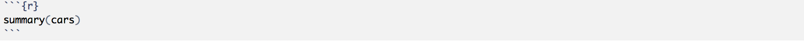
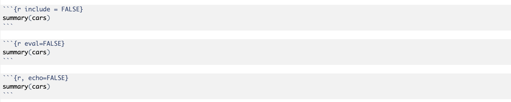
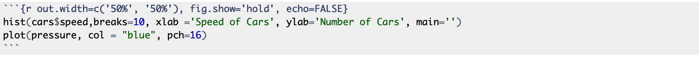
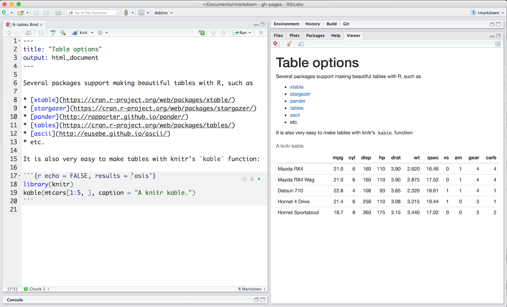
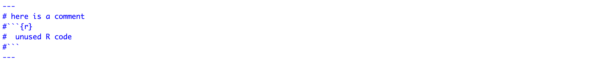
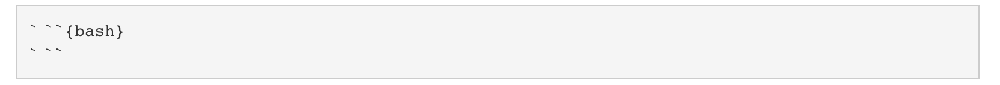

```{r setup,  include = FALSE}
knitr::opts_chunk$set(echo = TRUE)
```
# Overview
R Markdown provides an authoring framework for data science. You can use a single R Markdown file to both

* save and execute code
* generate high quality reports that can be shared with an audience

R Markdown documents are fully reproducible and support dozens of static and dynamic output formats. 

# How It Works
To open a new R Markdown file in the RStudio 

1. Go to File menu
2. Choose New File
3. Click R Markdown

**OR** simply locate the green plus sign on the left side of the R Studia frame, then click it and choose R Markdown.

Next, you can fill the Title and Author information for your file, and click OK button (you can change this any time). Now, you have a text file with an example for you to review. Save this file with the extension .Rmd, for instance save as `MyFirstRMarkdown.Rmd`.

Notice that the file contains three types of content:

* An (optional) YAML header surrounded by three hyphens (minus signs)  `---` 
* R code chunks surrounded by three back quote symbols ` ``` `  (back quote key is on the same key as the tilde ~ and directly below the Esc key in the top-left portion of the keyboard) 
* text mixed with simple text formatting

# Rendering output
To generate a report from the file, use the `Knit` button in the RStudio to render the file and preview the output with a single click or keyboard shortcut (Ctrl+Shift+K or Option+Shift+K). R Markdown generates a new file that contains selected text, code, and results from the .Rmd file. The new file can be a finished web page, PDF, MS Word ocument, slide show, notebook, handout, book, dashboard, package vignette or other format.

# Code Chunks
In this section, we'll use the date set `cars`. This data contains the speed of cars and the distances taken to stop in the 1920s. We don't need to import this file into R because, it is already located in the R Base. 

You can insert chunks into your file with

* the keyboard shortcut Ctrl + Alt + I (OS X: Cmd + Option + I)
* the Add Chunk command in the editor toolbar
* or by typing the chunk delimiters ` ```{r} ` and ` ``` `.

When you render your .Rmd file, R Markdown will run each code chunk and embed the results beneath the code chunk in your final report.

We can simply embed an R code chunk like this:


This will print both the R code and results on the output file. 

```{r}
summary(cars)
```

# Chunk Options
Chunk output can be customized with knitr option, arguments set in the {} of a chunk header. 

**Example.** Render the the following four R code chunks, and compaire their output files. Match the following answers with the R code chunks below.

1. Both the R code and result don't appear in the output document.   
2. The R code appers in the output document, but not the results.   
3. The results appers in the output document, but not the R code.   

---
#```{r echo=FALSE}
#library(knitr)
#include_graphics("~/Dropbox/Teaching Siena/MATH 275 Fall19/R Labs/picture2.png")
#```
---

 

---
#```{r include = FALSE}
#summary(cars)
#```

#```{r eval=FALSE}
#summary(cars)
#```

#```{r, echo=FALSE}
#summary(cars)
#```
---
Here, I list seven arguments to customize the chunk output:

* `include = FALSE` prevents code and results from appearing in the output document. R Markdown still runs the code in the chunk, and the results can be used by other chunks.
* `eval = FALSE` the source code appears in the output document, but not the results. R Markdown does NOT evaluate the code in the chunk.
* `echo = FALSE` the source code does not appear in the output document, but the results appear. This is a useful way to embed figures.
* `message = FALSE` prevents messages that are generated by code from appearing in the output document.
* `warning = FALSE` prevents warnings that are generated by code from appearing in the output document.
* `fig.cap = "..."` adds a caption to graphical results.
* `fig.align = "..."` aligns the figure in the output document (left, right or center).

There are a large number of chunk options in knitr documented at <https://yihui.name/knitr/options>.  

# Including Plots

We can embed plots, for example:

```{r}
hist(cars$speed,breaks=10, xlab ='Speed of Cars', ylab='Number of Cars', main='')
```
 
We can also custimize the figures, such as

```{r, echo=FALSE, fig.align='center', fig.cap='Histogram of speed of 50 cars recoreded in the 1920s.', out.width = "50%"}
hist(cars$speed,breaks=10, xlab ='Speed of Cars', ylab='Number of Cars', main='')
```

__Note.__

1. To make this ordered list, I've an empty line after the last word `Note.`
2. The `echo = FALSE` parameter was added to the code chunk to prevent printing of the R code that generated the plot.  
3. We use `fig.align='center'` to allign the figure on the center of the output document.  
4. The `fig.cap=' '` add a caption to the figure. The pdf document includes the figure number in front of the caption, such as `Figure 1.` however, the html or word outputs do not have this.  

**Example:** The following scatterplot may bew used to determine relation between temperature in degrees Celsius and vapor pressure of mercury in millimeters (of mercury). 
```{r, fig.align='center', out.width = "50%"}
plot(pressure, col = "blue", pch=16)
```

To see more tips and tricks for working with images and figures in R Markdown documents, visit 
<http://zevross.com/blog/2017/06/19/tips-and-tricks-for-working-with-images-and-figures-in-r-markdown-documents/>.

# Two figures in Two columns
You can display two plots one beside each other. Add `out.width=c('50%', '50%'), fig.show='hold'` to your chunk header. 



```{r out.width=c('50%', '50%'), fig.show='hold', echo=FALSE}
hist(cars$speed,breaks=10, xlab ='Speed of Cars', ylab='Number of Cars', main='')
plot(pressure, col = "blue", pch=16)
```

# Tables
By default, R Markdown displays data frames and matrixes as they would be in the R terminal (in a monospaced font). If you prefer that data be displayed with additional formatting you can use the knitr::kable function, as in the .Rmd file below.



Note the use of the results='asis' chunk option. This is required to ensure that the raw table output isn’t processed further by knitr.

# Equations 
Insert equation using Latex formating:

* for inline equation use write the equation between two dolar sign `$ equation $`, for instance $A = \pi*r^{2}$
* for centered equation use `$$ equation $$`, for instance $$\int_0^{\pi^2/4} \sin\sqrt{x}\,dx$$

#  Comment Out Unused Text in R Markdown

Extra yaml blocks can be used anywhere inside the document, and commented out with `#`



---
# here is a comment
#```{r}
#  unused R code
#```
---

# Text Formating
End a line with two spaces to start a new paragraph.  

*italics* and _italics_ 

**bold** and __bold__    
superscript^2^  

~~strikethrough~~  

[link](www.rstudio.com)  

# Header 1  
## Header 2  
### Header 3  
#### Header 4  
##### Header 5  
###### Header 6   

Add an horizontal line by adding 3 stars or 3 minus signs, e.i. *** or ---  

Note that, the horizontal break needs to be surrounded by a beginning and an ending new line.

***  

---

> block quote  

* unordered list 
* item 2
    + sub-item 1
    + sub-item 2
* item 3  

1. ordered list
2. item 2
    + sub-item 1
    + sub-item 2
3. item 3  

Table Header | Second Header  
------------- | -------------  
Table Cell | Cell 2   
Cell 3 | Cell 4    


# Global Options
To set global options that apply to every chunk in your file, call `knitr::opts_chunk$set` in a code chunk. Knitr will treat each option that you pass to `knitr::opts_chunk$set` as a global default that can be overwritten in individual chunk headers.

# Code Languages
The knitr can execute code in many languages besides R. Some of the available language engines include:

* Python
* SQL
* Bash
* Rcpp
* Stan
* JavaScript
* CSS

To process a code chunk using an alternate language engine, replace the ` r ` at the start of your chunk declaration with the name of the language:

{width=90%}

Note that chunk options like `echo` and results are all valid when using a language engine like python.